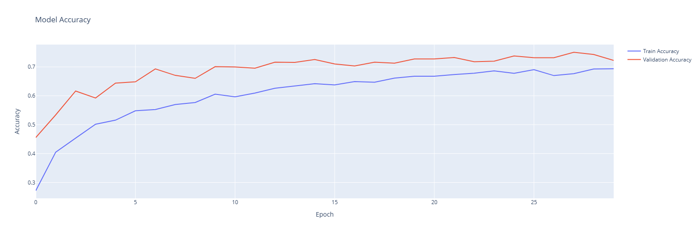
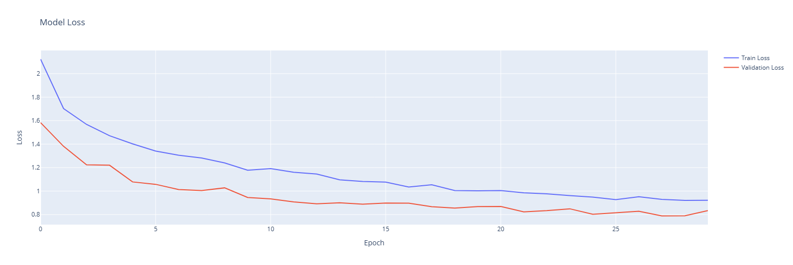
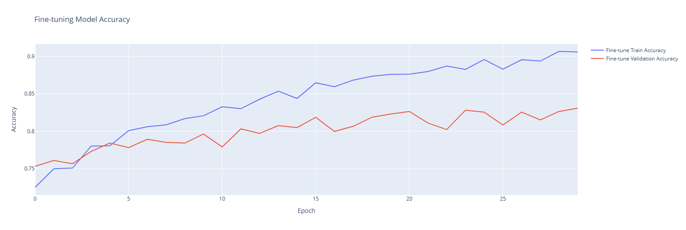
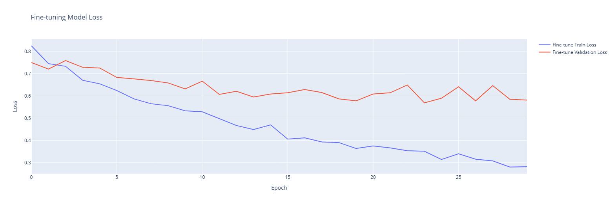
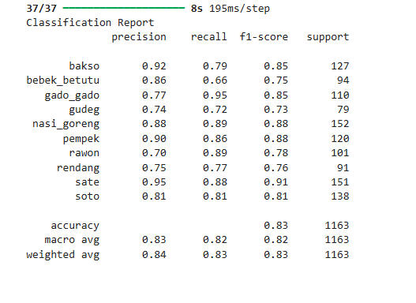
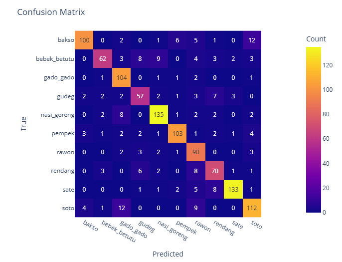
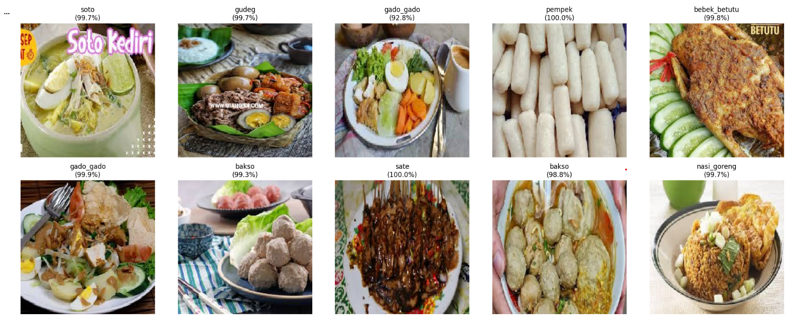

# Indonesian Food Classification with VGG16

## Project Overview
Proyek ini bertujuan untuk membangun model **Deep Learning** yang mampu mengklasifikasikan gambar makanan tradisional Indonesia. Mengingat variasi visual makanan yang tinggi dan dataset yang terbatas, proyek ini menerapkan teknik **Transfer Learning** menggunakan arsitektur **VGG16** (pre-trained on ImageNet).

Tujuan akhirnya adalah menciptakan model yang akurat dan efisien untuk mengenali berbagai jenis kuliner lokal.

## Dataset
Dataset yang digunakan terdiri dari gambar makanan Indonesia yang terbagi ke dalam **10** kategori, antara lain:
* Bakso
* Bebek Betutu
* Gado-Gado
* Nasi Goreng
* Pempek
* Rawon
* Rendang
* Sate
* Soto

*> Data telah melalui proses Augmentasi (Rotation, Zoom, Shift) untuk mencegah overfitting.*

## Methodology
Pendekatan yang digunakan dalam proyek ini:
1.  **Data Preprocessing**: Rescaling (1./255) dan Augmentasi Gambar menggunakan `ImageDataGenerator`.
2.  **Base Model**: Menggunakan **VGG16** sebagai *feature extractor* dengan bobot ImageNet.
3.  **Custom Head**: Menambahkan lapisan *Fully Connected* (Dense) dan *Dropout* di atas base model.
4.  **Fine-Tuning Strategy**:
    * *Phase 1*: Membekukan (Freeze) VGG16 dan hanya melatih lapisan klasifikasi baru.
    * *Phase 2*: Mengaktifkan (Unfreeze) sebagian layer atas VGG16 (setelah layer ke-15) dan melatih ulang dengan *learning rate* yang sangat kecil (`1e-5`) untuk adaptasi fitur yang lebih spesifik.

## Model Results & Performance
Berikut adalah hasil evaluasi model pada data uji (Test Set):

### 1. Accuracy & Loss Metrics
| Metric | Score |
| :--- | :--- |
| **Training Accuracy** | **[81.76]%** |
| **Test Accuracy** | **[83.06]%** |

*> Model menunjukkan performa yang stabil dengan selisih akurasi Training dan Validation yang kecil, menandakan model **Good Fit** (tidak Overfitting).*

### 2. Training History




*> Grafik di atas menunjukkan peningkatan akurasi dan penurunan loss seiring bertambahnya epoch, terutama setelah tahap Fine-Tuning dimulai.*

### 3. Classification Report
 

Berdasarkan Confusion Matrix, model paling baik dalam mengenali kelas **Bakso dan Pempek**, namun sedikit kesulitan membedakan antara **Gudeg vs Rendang**, **Rendang vs Rawon**.

### 4. Sample Predictions

*> Contoh hasil prediksi model pada gambar acak.*

## How to Run
1.  Clone repository ini:
    ```bash
    git clone [https://github.com/aarizkiyans/Indonesian-Food-Classification-with-VGG16.git](https://github.com/aarizkiyans/Indonesian-Food-Classification-with-VGG16.git)
    ```
2.  Install library yang dibutuhkan:
    ```bash
    pip install -r requirements.txt
    ```
3.  Jalankan Jupyter Notebook atau Google Colab.
4.  Pastikan dataset sudah terhubung (sesuaikan path direktori).

## Credits
### Project ini dibuat oleh **Muhammad Rizkiyanto**.
### Connect with me on [LinkedIn](https://www.linkedin.com/in/muhammad-rizkiyanto/).
### Inspire Code: [Kaggle](https://www.kaggle.com/code/muhammadfaizan65/fruits-and-vegetables-image-recognition-vgg16). 
